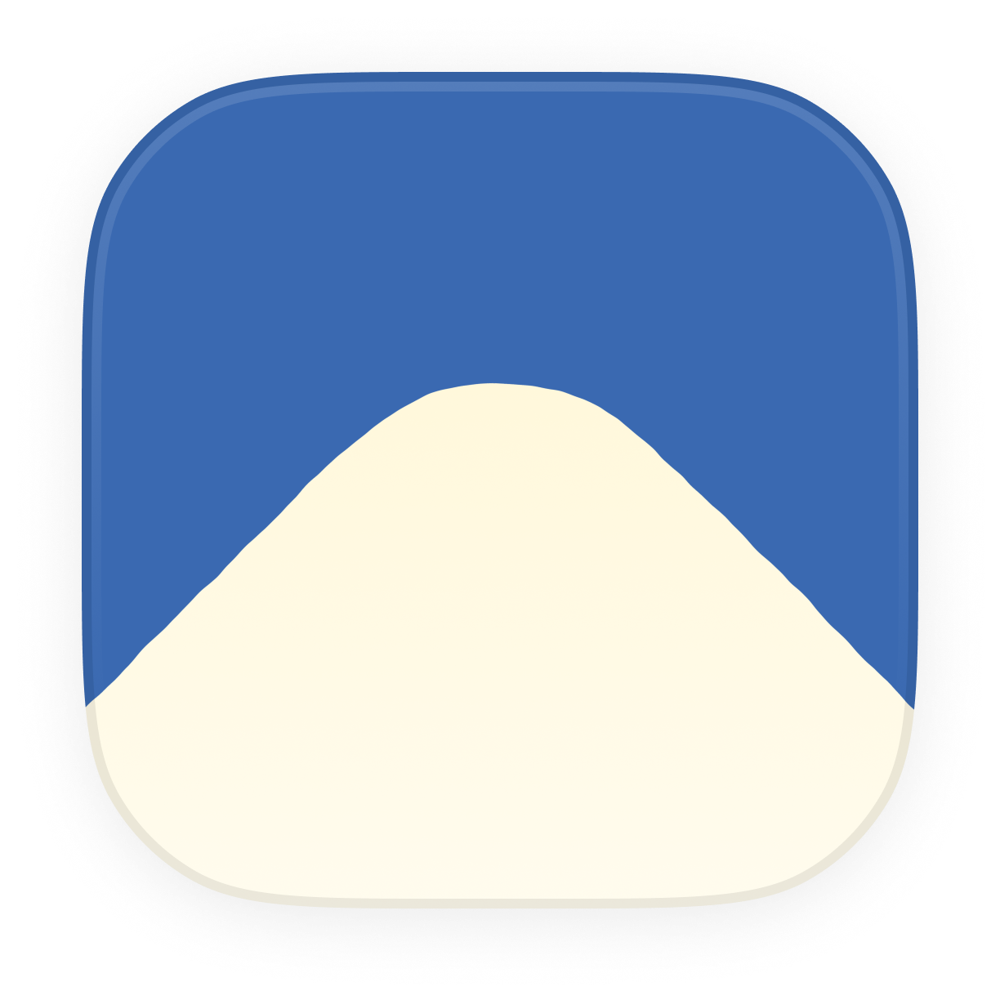

<div align="center">



<h1>Lisse</h1>
<sub>rhymes with lease</sub>

Figma-quality squircle smoothing for the web. Generate smooth-cornered SVG paths and clip-paths with per-corner control, borders, and shadows.

[](https://www.npmjs.com/package/@lisse/core)
[](https://www.npmjs.com/package/@lisse/react)
[](https://www.npmjs.com/package/@lisse/vue)
[](https://www.npmjs.com/package/@lisse/svelte)
[](./LICENSE)
[](https://github.com/JaceThings/Lisse/actions)
[](https://www.typescriptlang.org/)
[](https://bundlephobia.com/package/@lisse/core)

</div>

<!-- Visual: Hero image - side-by-side comparison of standard CSS border-radius vs Lisse squircle applied to a card. Show the difference clearly. Recommended ~800px wide. Place at /assets/hero.png -->

## What is this?

Standard CSS `border-radius` produces circular arcs at the corners of an element. Designers (and Apple, and Figma) prefer **squircles** -- corners where the curvature transitions smoothly into the straight edges, creating a more organic, polished shape.

Lisse implements [Figma's corner smoothing algorithm](https://www.figma.com/blog/desperately-seeking-squircles/) in JavaScript. It generates SVG paths and CSS `clip-path` values that you can apply to any element, with first-class bindings for React, Vue, and Svelte.

## Features

- Pixel-perfect reproduction of Figma's squircle algorithm
- Per-corner radius and smoothing control
- Inner, outer, and middle borders with style variants (solid, dashed, dotted, double, groove, ridge)
- Inner shadow and drop shadow effects
- Auto-effects: CSS borders and shadows are automatically converted to SVG equivalents
- Framework bindings for React, Vue, and Svelte
- Lightweight core with zero dependencies
- DOM-free `/path` subpath export for SSR and edge runtimes
- TypeScript-first with full type coverage
- Auto-updates on element resize via shared `ResizeObserver`
- Tree-shakeable ESM and CJS builds

## Which API Should I Use?

Each framework binding offers two ways to apply smooth corners:

| | Component | Hook / Composable / Action |
|---|---|---|
| **What it does** | Renders its own element with smooth corners applied | Applies smooth corners to an existing element you already have |
| **When to use** | Building new UI from scratch, or when you want a drop-in replacement for a `<div>` | You already have an element and want to add smooth corners without changing your DOM structure |
| **Effects** | Handled automatically (wrapper div is created for you) | You manage the wrapper element yourself (React/Vue) or ensure the parent has `position: relative` (Svelte) |

If you're starting fresh, the component is simpler. If you're adding smooth corners to existing elements, use the hook/composable/action.

## Quick Start

### React

```sh
npm install @lisse/react
```

**Component:**

```tsx
import { SmoothCorners } from "@lisse/react";

function Card() {
  return (
    <SmoothCorners radius={20} smoothing={0.6} style={{ background: "#fff", padding: 24 }}>
      <h2>Hello, squircle</h2>
    </SmoothCorners>
  );
}
```

**Hook:**

```tsx
import { useRef } from "react";
import { useSmoothCorners } from "@lisse/react";

function Card() {
  const ref = useRef<HTMLDivElement>(null);
  useSmoothCorners(ref, { radius: 20, smoothing: 0.6 });
  return <div ref={ref} style={{ background: "#fff", padding: 24 }}>Hello</div>;
}
```

### Vue

```sh
npm install @lisse/vue
```

**Composable:**

```vue
<script setup>
import { ref } from "vue";
import { useSmoothCorners } from "@lisse/vue";

const el = ref(null);
useSmoothCorners(el, { radius: 20, smoothing: 0.6 });
</script>

<template>
  <div ref="el" style="background: #fff; padding: 24px">Hello, squircle</div>
</template>
```

**Component:**

```vue
<script setup>
import { SmoothCorners } from "@lisse/vue";
</script>

<template>
  <SmoothCorners :radius="20" :smoothing="0.6" style="background: #fff; padding: 24px">
    <h2>Hello, squircle</h2>
  </SmoothCorners>
</template>
```

### Svelte

```sh
npm install @lisse/svelte
```

```svelte
<script>
  import { smoothCorners } from "@lisse/svelte";
</script>

<div use:smoothCorners={{ radius: 20, smoothing: 0.6 }} style="background: #fff; padding: 24px">
  Hello, squircle
</div>
```

### Vanilla JS / Core

```sh
npm install @lisse/core
```

```ts
import { generatePath, generateClipPath } from "@lisse/core";

const path = generatePath(200, 200, { radius: 40, smoothing: 0.6 });
// Use in an <svg> element: <path d={path} />

const clipPath = generateClipPath(200, 200, { radius: 40 });
element.style.clipPath = clipPath;
```

<!-- Visual: Grid of 4 cards showing the library used in React, Vue, Svelte, and vanilla JS. Each card has smooth corners applied. Place at /assets/framework-examples.png -->

## Per-Corner Configuration

Every binding accepts per-corner overrides. Each corner can be a number (radius only, using default smoothing) or a full `CornerConfig` object:

```ts
const options = {
  topLeft: { radius: 40, smoothing: 0.8 },
  topRight: 20,
  bottomRight: { radius: 30, smoothing: 0.4, preserveSmoothing: false },
  bottomLeft: 0,
};
```

When adjacent corners compete for space, larger radii are given priority and smaller corners are reduced proportionally.

<!-- Visual: Single squircle with different radius values per corner, annotated with the radius value at each corner. Place at /assets/per-corner.png -->

## Effects

Lisse clips your element with `clip-path`, which slices through CSS borders and shadows. The library provides SVG-based replacements that follow the squircle shape perfectly.

### Built-in Effects

All framework bindings support five effects rendered as SVG overlays:

| Effect | Description |
|--------|-------------|
| `innerBorder` | Border drawn inside the squircle path (clipped to the shape) |
| `outerBorder` | Border drawn outside the squircle path (masked to the exterior) |
| `middleBorder` | Border centered on the squircle path (half inside, half outside) |
| `innerShadow` | Inset shadow inside the squircle |
| `shadow` | Drop shadow behind the squircle |

```tsx
<SmoothCorners
  radius={24}
  innerBorder={{ width: 1, color: "#ffffff", opacity: 0.2 }}
  outerBorder={{ width: 2, color: "#000000", opacity: 0.1 }}
  middleBorder={{ width: 1, color: "#ff0000", opacity: 0.5 }}
  innerShadow={{ offsetX: 0, offsetY: 2, blur: 4, spread: 0, color: "#000000", opacity: 0.15 }}
  shadow={{ offsetX: 0, offsetY: 8, blur: 24, spread: 0, color: "#000000", opacity: 0.2 }}
  style={{ background: "linear-gradient(135deg, #667eea, #764ba2)", padding: 32 }}
>
  <p style={{ color: "#fff" }}>Card with all effects</p>
</SmoothCorners>
```

#### Multiple Shadows

Both `shadow` and `innerShadow` accept a single `ShadowConfig` or an array of `ShadowConfig[]`. When auto-extracting from CSS, all `box-shadow` layers are extracted -- not just the first.

```tsx
<SmoothCorners
  radius={24}
  shadow={[
    { offsetX: 0, offsetY: 2, blur: 4, spread: 0, color: "#000000", opacity: 0.1 },
    { offsetX: 0, offsetY: 8, blur: 24, spread: -4, color: "#000000", opacity: 0.2 },
  ]}
  innerShadow={[
    { offsetX: 0, offsetY: 1, blur: 2, spread: 0, color: "#000000", opacity: 0.1 },
    { offsetX: 0, offsetY: -1, blur: 2, spread: 0, color: "#ffffff", opacity: 0.05 },
  ]}
  style={{ background: "#fff", padding: 32 }}
>
  Card with layered shadows
</SmoothCorners>
```

CSS `box-shadow` with multiple layers is also extracted automatically:

```tsx
{/* Both shadow layers are extracted and rendered as SVG */}
<SmoothCorners
  radius={24}
  style={{
    background: "#fff",
    padding: 32,
    boxShadow: "0 2px 4px rgba(0,0,0,0.1), 0 8px 24px rgba(0,0,0,0.2)",
  }}
>
  Auto-extracted multiple shadows
</SmoothCorners>
```

<!-- Visual: 2x2 grid showing each effect type: inner border, outer border, inner shadow, drop shadow. Each on a squircle card. Place at /assets/effects-grid.png -->

### Border Styles

All three border types (`innerBorder`, `outerBorder`, `middleBorder`) support style variants:

| Style | Description |
|-------|-------------|
| `solid` | Default. Continuous stroke. |
| `dashed` | Dashed stroke. Customize with `dash` and `gap`. |
| `dotted` | Dotted stroke (round caps by default). Customize with `dash` and `gap`. |
| `double` | Two lines with a gap in the middle. Requires `width >= 3`. |
| `groove` | 3D grooved effect (darker shade on the outside). |
| `ridge` | 3D ridged effect (darker shade on the inside). |

```tsx
<SmoothCorners
  radius={24}
  innerBorder={{
    width: 4,
    color: "#3b82f6",
    opacity: 1,
    style: "dashed",
    dash: 12,     // dash length (default: width * 3)
    gap: 6,       // gap length (default: width * 2)
    lineCap: "round",  // "butt" | "round" | "square"
  }}
>
  Dashed border
</SmoothCorners>
```

### Gradient Borders

`BorderConfig.color` accepts either a hex string or a `GradientConfig` object, enabling gradient-colored borders on any border type (`innerBorder`, `outerBorder`, `middleBorder`) and any border style (`solid`, `dashed`, `dotted`, `double`, `groove`, `ridge`).

Gradient borders are **API-only** -- they cannot be auto-extracted from CSS `border-image`.

Two gradient types are available:

- **`LinearGradientConfig`** -- `{ type: "linear", angle?: number, stops: GradientStop[] }`. The `angle` is in CSS degrees (default `0`, which is bottom-to-top; `90` is left-to-right).
- **`RadialGradientConfig`** -- `{ type: "radial", cx?: number, cy?: number, r?: number, stops: GradientStop[] }`. All values are relative (0 to 1), defaulting to `0.5`.

Each `GradientStop` is `{ offset: number, color: string, opacity?: number }` where `offset` ranges from 0 to 1.

For `groove` and `ridge` border styles, each stop's color is automatically darkened (via `RGB * 2/3`) to produce the 3D shading effect.

```tsx
<SmoothCorners
  radius={24}
  innerBorder={{
    width: 2,
    color: {
      type: "linear",
      angle: 135,
      stops: [
        { offset: 0, color: "#667eea" },
        { offset: 1, color: "#764ba2" },
      ],
    },
    opacity: 1,
  }}
  style={{ background: "#fff", padding: 32 }}
>
  Gradient border
</SmoothCorners>
```

Radial gradient example:

```tsx
<SmoothCorners
  radius={24}
  outerBorder={{
    width: 3,
    color: {
      type: "radial",
      cx: 0.5,
      cy: 0.5,
      r: 0.7,
      stops: [
        { offset: 0, color: "#ff6b6b" },
        { offset: 0.5, color: "#feca57", opacity: 0.8 },
        { offset: 1, color: "#48dbfb" },
      ],
    },
    opacity: 1,
    style: "dashed",
    dash: 8,
    gap: 4,
  }}
  style={{ background: "#1a1a2e", padding: 32, color: "#fff" }}
>
  Radial gradient dashed border
</SmoothCorners>
```

### Auto Effects

By default, Lisse automatically reads your CSS and converts it to SVG equivalents. On mount, the library:

1. Reads the element's computed `border` and `box-shadow`
2. Converts them to SVG effects (`innerBorder`, `shadow`, `innerShadow`)
3. Strips the CSS properties so they don't get clipped
4. Restores the original CSS on unmount

This means elements with existing CSS borders and shadows just work:

```tsx
{/* CSS border is automatically converted to an SVG inner border */}
<SmoothCorners radius={24} style={{ border: "2px solid red" }}>
  Content
</SmoothCorners>
```

Explicit effect props take priority over auto-extracted values:

```tsx
{/* Explicit innerBorder wins over the CSS border */}
<SmoothCorners
  radius={24}
  style={{ border: "2px solid red" }}
  innerBorder={{ width: 1, color: "#00ff00", opacity: 1 }}
>
  Content
</SmoothCorners>
```

#### Disabling auto effects

Pass `autoEffects={false}` (React), `:auto-effects="false"` (Vue), or `autoEffects: false` (Svelte). When disabled, CSS borders and shadows are left untouched and no automatic extraction occurs.

#### What gets extracted

| CSS property | SVG effect | Notes |
|---|---|---|
| `border` | `innerBorder` | Width, color, opacity, and style (including `dashed`, `dotted`, `double`, `groove`, `ridge`) are extracted from the top edge. |
| `box-shadow` (outer) | `shadow` | All outer shadows (supports multiple). |
| `box-shadow` (inset) | `innerShadow` | All inset shadows (supports multiple). |

> **Note:** `middleBorder` and `outerBorder` have no CSS equivalent and are only available as explicit props.

#### Limitations

| CSS feature | What happens |
|---|---|
| Per-side borders | Only the top border is read. All four sides are stripped. |
| `inset`, `outset` border styles | Rendered as solid. |
| `border-image` | Not detected. Use gradient borders via the API instead. |
| `outline` | Not read or stripped. |

- **Per-side borders** -- Only the top border is read during auto-extraction because `getComputedStyle` returns per-side values (`borderTopWidth`, `borderTopColor`, etc.) and the SVG overlay renders a single uniform border around the entire squircle. If you need different colors per side, use explicit effect props.
- **`border-image`** -- Not detected because CSS `border-image` syntax is complex (angle units, color spaces, slice semantics). Reliably parsing all variants is not feasible. Use gradient borders via the explicit `BorderConfig.color` API instead.
- **`outline`** -- Not extracted because CSS outlines don't follow `border-radius` in all browsers, and the squircle shape would make standard outlines look incorrect. The library does not attempt to replicate them.
- **One-time extraction** -- CSS effects are read once on mount because continuously polling `getComputedStyle` would hurt performance. Changes to CSS borders or shadows after mount will not be reflected. Use explicit effect props for dynamic values.
- **`!important` rules** -- Cannot be overridden because the library strips effects via inline styles, and `!important` stylesheet rules take precedence over inline styles. The CSS property stays visible alongside the SVG replacement. Move the rule to a non-`!important` selector, or use `autoEffects: false`.
- **CSS transitions** -- Stripped properties (`border`, `box-shadow`) will not animate because they are removed from the element and replaced with SVG. The SVG effects themselves are not animated. Use `autoEffects: false` and drive explicit effect props instead.
- **`double` border minimum width** -- Requires `border-width >= 3px` because the double style needs space for two lines and a gap between them. Below 3px, the border falls back to solid.
- **`groove` / `ridge` shading** -- The dark shade is computed as `RGB * 2/3`, matching Firefox's algorithm. This may look slightly different from browser CSS rendering on standard rectangles, but produces consistent results across browsers on squircle shapes.
- **Wrapper div (React/Vue)** -- The `<SmoothCorners>` component injects a wrapper `<div>` with `position: relative` for SVG overlay positioning. This can affect flex/grid layouts and child selectors. Use the hook/composable/action approach for full layout control.
- **Gradient border auto-extraction** -- Gradient borders are API-only. CSS `border-image` is not detected or extracted because its syntax (angle units, color spaces, slice semantics) is too complex to reliably parse. Use explicit `GradientConfig` via `BorderConfig.color` instead.

## SSR / Path-Only Import

The core package provides a `/path` subpath export that excludes all DOM-dependent code. Use it in server-side rendering, Node.js scripts, or edge runtimes:

```ts
// DOM-free import - safe for SSR, Node.js, edge runtimes
import { generatePath } from "@lisse/core/path";
```

The `/path` export includes `generatePath`, `generateClipPath`, `getPathParamsForCorner`, `distributeAndNormalize`, `getSVGPathFromPathParams`, `toRadians`, `rounded`, `nextUid`, `hexToRgb`, `SVG_NS`, and `DEFAULT_SHADOW`. It excludes `createSvgEffects`, `createDropShadow`, and `observeResize`.

## Packages

| Package | Description | Docs |
|---------|-------------|------|
| [`@lisse/core`](https://www.npmjs.com/package/@lisse/core) | Framework-agnostic path generation and effects | [README](./packages/core/README.md) |
| [`@lisse/react`](https://www.npmjs.com/package/@lisse/react) | React hook and component | [README](./packages/react/README.md) |
| [`@lisse/vue`](https://www.npmjs.com/package/@lisse/vue) | Vue composable and component | [README](./packages/vue/README.md) |
| [`@lisse/svelte`](https://www.npmjs.com/package/@lisse/svelte) | Svelte action | [README](./packages/svelte/README.md) |

## How It Works

The algorithm is based on [Figma's blog post on squircles](https://www.figma.com/blog/desperately-seeking-squircles/) and produces the same smooth corners you see in Figma's design tool.

A standard `border-radius` arc is a quarter circle -- the curvature jumps abruptly from zero (along the straight edge) to a fixed value (along the arc). A squircle uses a series of bezier curves that ease into and out of the corner, distributing curvature smoothly across a longer segment of the edge.

The `smoothing` parameter (0 to 1) controls how far the curvature extends along the edges. At `smoothing: 0` the output is identical to a standard `border-radius`. At `smoothing: 1` the curvature occupies the maximum possible edge length.

When `preserveSmoothing` is `true` (the default), the algorithm maintains the requested smoothing value even if it means reducing the effective corner radius. When `false`, the radius is preserved and smoothing is reduced to fit.

<!-- Visual: Diagram showing a smooth corner's bezier control points (a, b, c, d, p) versus a standard circular arc. Reference Figma's blog post illustration style. Place at /assets/corner-anatomy.png -->

### Border Rendering

The library supports three border positions, each using a different SVG technique to achieve precise placement relative to the squircle path.

**Inner border** draws the SVG stroke at double the specified width, then clips it to the squircle shape. Because a stroke straddles the path (half inside, half outside), clipping removes the outer half entirely. Only the inner portion remains visible, so `innerBorder` appears to sit neatly inside the shape.

**Outer border** also draws the stroke at double width, but instead of clipping it uses an SVG mask. The mask is a white rectangle (fully visible) with a black squircle path cut out of it (fully hidden). This hides the inner half of the stroke and reveals only the outer half. The mask bounds are extended by the border width so the stroke is never cut off at the edges of the SVG.

**Middle border** is the simplest case. The stroke is drawn at its actual width with no clip or mask applied. It naturally straddles the path, half inside and half outside the squircle.

### Shadow Rendering

**Drop shadow** does not use CSS `box-shadow`, which would follow the rectangular bounding box and get clipped. Instead, the library generates an actual squircle SVG path expanded by the `spread` value in all directions. This path is filled with the shadow color, translated by `offsetX`/`offsetY`, and blurred using an SVG `feGaussianBlur` filter. The shadow SVG is positioned behind the element at `z-index: -1` using `isolation: isolate` to create a proper stacking context.

**Inner shadow** uses an SVG mask with a cutout. A white rectangle defines the visible area, and a black squircle path punched out of it creates the hole. A colored rectangle drawn behind this mask produces the appearance of shadow around the inside edges. The cutout path is adjusted for `spread` (shrinking the hole) and `offset` (shifting it). The result is blurred with `feGaussianBlur` and then clipped to the original squircle shape so nothing leaks outside.

### Multiple Shadow Rendering Order

When an array of shadows is provided, the first shadow in the array renders on top (closest to the element). Each shadow gets its own SVG filter element. Shadows are rendered in reverse order in the SVG DOM so that SVG's "later paints on top" rule matches CSS's "first listed is topmost" convention.

### Auto-Effects: Content-Box Compensation

When `autoEffects` strips a CSS border from an element using `box-sizing: content-box`, removing the border would cause layout shift -- the content area would expand to fill the space the border occupied. To prevent this, the library automatically increases padding by the border width on each side. The original padding values are saved and restored on cleanup.

### Resize Handling

All Lisse instances share a single `ResizeObserver`. Callbacks are batched via `requestAnimationFrame` so that multiple elements resizing in the same frame only trigger one re-render pass. When the last observed element is removed, the observer disconnects automatically.

### Anchor Positioning

The SVG overlays (borders, shadows) are absolutely positioned inside an anchor element. The library automatically sets `position: relative` on this anchor if it has `position: static`. A ref-counting system ensures that if multiple Lisse instances share the same anchor, the position is only reset to `static` when the last instance unmounts.

## API Reference

| Function / Export | Package | Description |
|-------------------|---------|-------------|
| `generatePath(width, height, options)` | `core` | Generate an SVG path `d` string |
| `generateClipPath(width, height, options)` | `core` | Generate a CSS `clip-path: path(...)` string |
| `getPathParamsForCorner(params)` | `core` | Compute bezier control points for a single corner |
| `distributeAndNormalize(rect)` | `core` | Distribute radii across a rectangle, resolving overlaps |
| `getSVGPathFromPathParams(input)` | `core` | Assemble a full SVG path from corner parameters |
| `createSvgEffects(anchor)` | `core` | Create an SVG overlay for borders and inner shadows |
| `createDropShadow(anchor)` | `core` | Create a path-based drop shadow |
| `extractAndStripEffects(el)` | `core` | Extract CSS border/shadow and convert to SVG effects |
| `restoreStyles(el, saved)` | `core` | Restore stripped CSS border/shadow styles |
| `observeResize(el, callback)` | `core` | Observe element resize with a shared `ResizeObserver` |
| `useSmoothCorners(ref, options, effects?)` | `react` | React hook for applying smooth corners |
| `SmoothCorners` | `react` | React component with built-in effects |
| `useSmoothCorners(target, options, effects?)` | `vue` | Vue composable for applying smooth corners |
| `SmoothCorners` | `vue` | Vue component with built-in effects |
| `smoothCorners(node, input)` | `svelte` | Svelte action for applying smooth corners |

See individual package READMEs for full API details.

## License

[MIT](./LICENSE)

---

<div align="center">

Built by [Jace](https://ja.mt)

[X](https://ja.mt/x) | [Bluesky](https://ja.mt/bsky) | [Instagram](https://ja.mt/ig) | [Threads](https://ja.mt/threads)

</div>
